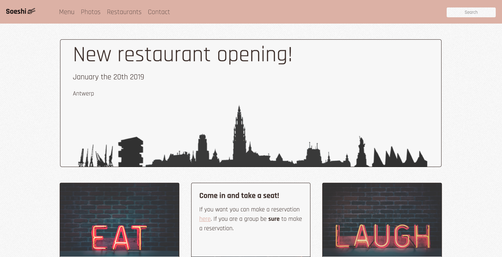

# Project Bootstrap-site
## Restaurant franchise website

https://paulineeds.github.io/restaurant-css-framework/

A website for a restaurant franchise with bootstrap.
With a few topics

The site has to be responsive: it needs to be adapted to small devices (xs) and middle big devices(md)

At least 5 pages accessible by a navbar on every page. A link to the different sections: Home, Menu, pictures, Restaurants and Contact.

#### What is in the website

- A home page with a Jumbotron-component and 2 Cards.
- A Menu page with the menu as a group-list.
- A Photos page with pictures (at least 10) and pagination (3 photos a page).
- A Restaurants page with the adress, a map and openinghours.
- A Contact page with a contactform.

## Technologies
- Bootstrap 4
- SCSS
- HTML

## Preview

